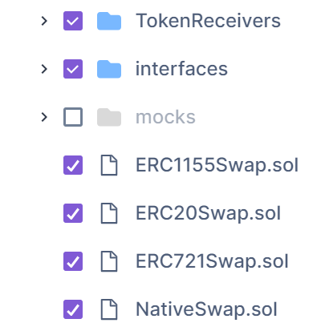
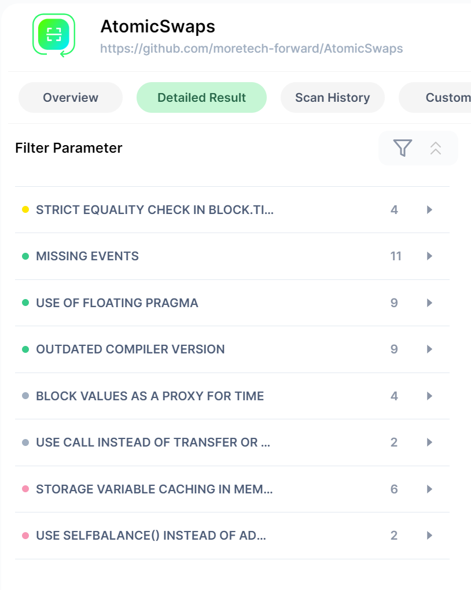
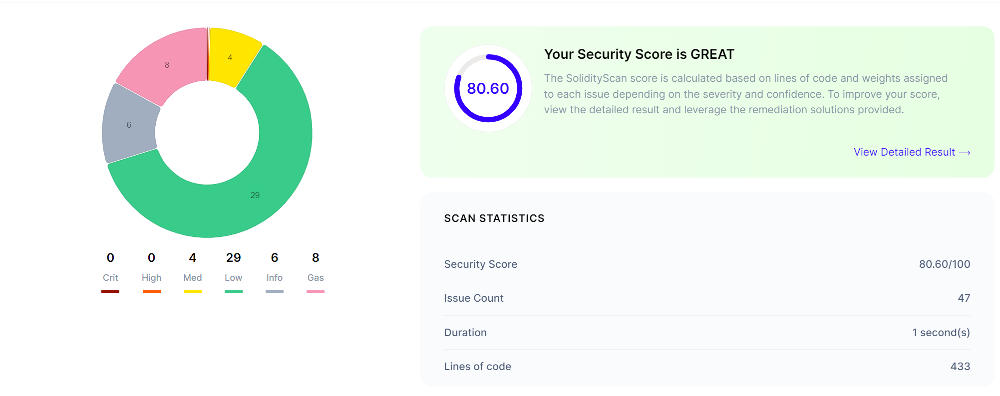

# Audit

## Scope



## Findings

### Manual audit

To protect against a timing attack, where party A reveals the key at the last moment and prevents party B from confirming the exchange because the exchange time ends at the same moment, a delay of one day is added for party A that initiates the exchange.

### [solidityscan.com](solidityscan.com)




#### MEDIUM

The vulnerability is falsely positive because it requires the output to be available after the `deadline`.
The vulnerability is relevant for strict equals.

And SolidityScan says that using non-strict inequality in require consumes more gas.

#### LOW

- `SELFBALANCE()` optimizes the compiler

### Slither

```sh
slither .
```

#### [Functions that send Ether to arbitrary destinations](https://github.com/crytic/slither/wiki/Detector-Documentation#functions-that-send-ether-to-arbitrary-destinations)

False positive, as it is clearly controlled to whom the ether is sent

#### [Contracts that lock Ether](https://github.com/crytic/slither/wiki/Detector-Documentation#contracts-that-lock-ether)

It appeared because SolidityScan was complaining about gas optimizations and asked to make `payable` functions (such a function does not check that `msg.value == 0` and therefore costs cheaper)

The implication is that users will not send `msg.value` to the contract, hence ether will not be blocked.
